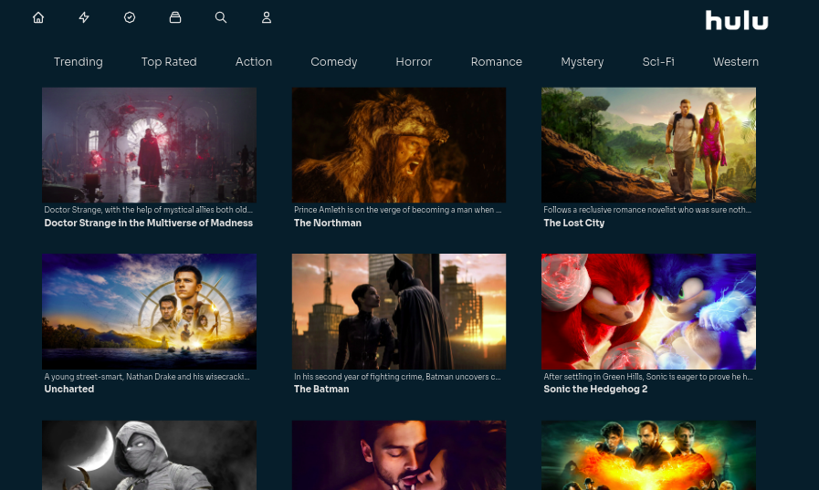

# Clone de interface da plataforma Hulu

## 📝 Sobre o Projeto
Projeto de um clone de UI so site de streaming <a href="https://www.hulu.com/welcome?orig_referrer=https%3A%2F%2Fwww.google.com%2F">Hulu</a>

Clique <a href="https://hulu-clone-2-0.vercel.app/">aqui</a> para visualizar a aplicação em produção

## ⚙️ Tecnologias e bibliotecas usadas no Projeto

<ul>
  <li> <a href="https://nextjs.org/">React</a> </li>
  <li> <a href="https://mui.com/getting-started/installation/">Material-UI</a> </li>
</ul>

## ✨ Demonstração

Veja abaixo algumas Screenshots do projeto. 

